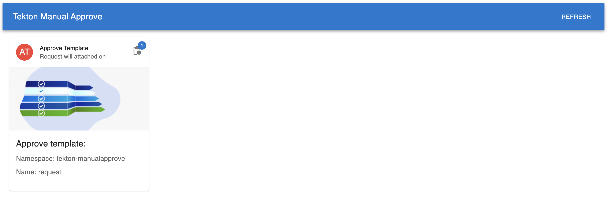
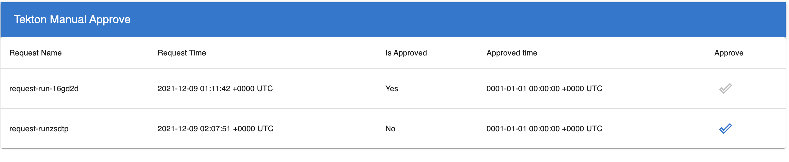

# Tekton Manual Approve

In a [Tekton](https://github.com/tektoncd/pipeline) pipeline, sometimes, we need to pause on a certain step to wait a manual approve or someting, the whole pipeline will blocked unless approved. This repo supplied such functionality.

### CRD introduced:
[ApproveRequest](https://github.com/vincent-pli/manual-approve-tekton/blob/main/config/300-approverequest.yaml)  
The CRD is a approve request template.
In its `spec`, should be some information of the approver or other things about the approve.
In its `status`, will keep a array for all approve request who bind to the template, like this:
```
status:
  requests:
  - approved: true
    requestTimestamp: "2021-12-09T01:11:42Z"
    requstName: request-run-16gd2d
  - requestTimestamp: "2021-12-09T02:07:51Z"
    requstName: request-runzsdtp
```

### Controller
The controller is based on [knative-pkg](https://github.com/knative-sandbox/sample-controller)

### GUI
The project has a very simple GUI to do the approvement, like this:


and



### Quick Start
The repo managered with [KO](https://github.com/google/ko), so please make sure `ko` is ready.

1. Deploy    
   ```
   ko apply -f config/
   ```
  
2. Export GUI
   ```
   kubectl -n tekton-manualapprove port-forward svc/controller 8888:80 --address 0.0.0.0
   ```

3. Create `ApproveRequest`

   ```
   kubectl create -f request.yaml
   ```

4. Create `Run`
   ```
   kubectl create -f run.yaml
   ```

5. Visite the GUI
